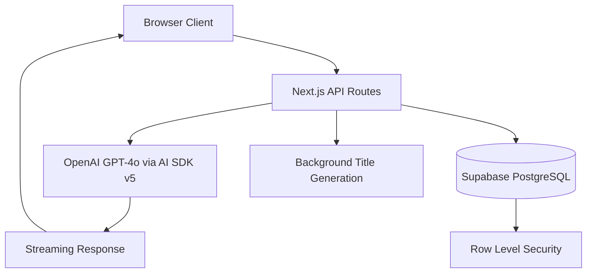

# David-GPT Current Architecture

## Overview

This document describes the current architecture of David-GPT, a ChatGPT-style AI chat application built with Next.js 15, Vercel AI SDK v5, and Supabase. This serves as context for implementing the RAG functionality described in `RAG-PRD.md` without breaking existing chat streaming, conversation persistence, and title generation.

## High-Level Architecture



## Technology Stack

- **Frontend**: Next.js 15 with App Router, React 19, TypeScript
- **AI Integration**: Vercel AI SDK v5 with OpenAI provider
- **Database**: Supabase (PostgreSQL with RLS)
- **Authentication**: Supabase Auth
- **Streaming**: Server-sent events via AI SDK v5
- **State Management**: TanStack Query (React Query)
- **UI**: shadcn/ui components, Tailwind CSS v4

## Database Schema

### Core Tables

```sql
-- Conversations table
create table public.conversations (
  id uuid primary key default uuid_generate_v4(),
  owner uuid not null references auth.users(id) on delete cascade,
  title text not null default 'New chat',
  title_status text not null default 'pending' check (title_status in ('pending', 'ready', 'error')),
  created_at timestamptz not null default now(),
  updated_at timestamptz not null default now(),
  last_message_at timestamptz not null default now(),
  deleted_at timestamptz -- Soft delete
);

-- Messages table
create table public.messages (
  id bigserial primary key,
  conversation_id uuid not null references conversations(id) on delete cascade,
  role text not null check (role in ('user', 'assistant', 'system', 'tool')),
  parts jsonb not null, -- AI SDK v5 compatible structure
  provider_message_id text, -- For idempotency
  created_at timestamptz not null default now()
);
```

### Key Features
- **Soft Delete**: Conversations use `deleted_at` for soft deletion
- **AI SDK v5 Compatibility**: Messages use JSONB `parts` structure
- **Idempotency**: `provider_message_id` prevents duplicate message insertion
- **Performance Indexes**: Optimized for conversation listing and message retrieval
- **RLS Policies**: Strict user isolation for multi-tenant security

## Chat Streaming Flow

### 1. Client-Side Streaming (`useChat` hook)

```typescript
// Location: src/lib/hooks/use-chat.ts
const sendMessage = async (messages: UIMessage[], conversationId?: string) => {
  // POST to /api/chat with streaming
  const response = await fetch('/api/chat', {
    method: 'POST',
    body: JSON.stringify({ uiMessages: messages, conversationId })
  })
  
  // Process streaming chunks
  const reader = response.body.getReader()
  while (!done) {
    const chunk = await reader.read()
    onChunk(chunk) // Real-time UI updates
  }
}
```

### 2. Server-Side Streaming (`/api/chat`)

```typescript
// Location: src/app/api/chat/route.ts
export async function POST(request) {
  // 1. Authenticate user
  const { user } = await supabase.auth.getUser()
  
  // 2. Convert UIMessages to AI SDK format
  const messages = uiMessages.map(msg => ({
    role: msg.role,
    content: extractTextContent(msg.parts)
  }))
  
  // 3. Create streaming response
  const result = streamText({
    model: openai('gpt-4o'),
    system: DAVID_FATTAL_SYSTEM_PROMPT,
    messages,
    onFinish: async (result) => {
      // 4. Persist messages after streaming completes
      await persistMessagesAfterStreaming(conversationId, uiMessages, result, user.id)
    }
  })
  
  return result.toTextStreamResponse() // Stream to client
}
```

### 3. Message Persistence Flow

```typescript
// Runs after streaming completes (non-blocking for user)
async function persistMessagesAfterStreaming(conversationId, userMessages, aiResult, userId) {
  // 1. Create conversation if doesn't exist
  if (!conversationId) {
    const conversation = await supabase
      .from('conversations')
      .insert({ title: 'New chat', title_status: 'pending', owner: userId })
  }
  
  // 2. Save user messages (with idempotency check)
  await supabase.from('messages').insert(userMessageInserts)
  
  // 3. Save assistant response
  await supabase.from('messages').insert([assistantMessage])
  
  // 4. Trigger inline title generation
  await generateTitleInline(conversationId)
}
```

## Title Generation System

### Architecture
- **Trigger**: After first assistant response in new conversation
- **Processing**: Inline (synchronous) generation using OpenAI
- **States**: `pending` → `ready` | `error`
- **Race Safety**: Atomic updates with status checks
- **Retry**: Manual retry capability via UI

### Title Generation Flow

```typescript
// Location: src/app/api/chat/route.ts (generateTitleInline)
async function generateTitleInline(conversationId: string) {
  // 1. Check if this is first exchange (exactly 1 user message)
  const userMessageCount = await countUserMessages(conversationId)
  if (userMessageCount !== 1) return
  
  // 2. Get conversation context (user + assistant messages)
  const messages = await getFirstExchange(conversationId)
  
  // 3. Generate title using David Fattal persona prompt
  const result = await streamText({
    model: openai('gpt-4o'),
    system: DAVID_FATTAL_TITLE_PROMPT,
    messages: [{ role: 'user', content: conversationContext }],
    temperature: 0.2
  })
  
  // 4. Race-safe update (only if still 'pending')
  await supabase
    .from('conversations')
    .update({ title: cleanedTitle, title_status: 'ready' })
    .eq('id', conversationId)
    .eq('title_status', 'pending') // Race condition protection
}
```

### David Fattal Title Persona
- **Expertise**: Quantum computing, light field displays, Spatial AI
- **Format**: 3-6 words, Title Case, technical terminology
- **Examples**: "Quantum Light Field Physics", "3D Display Manufacturing"

## State Management

### Frontend State Architecture

```typescript
// Conversation list management
useConversations() // TanStack Query for conversation CRUD
  └─ Global refresh function for real-time updates

// Message management per conversation  
useMessages(conversationId) // TanStack Query for message history
  ├─ addMessage() // Optimistic UI updates
  ├─ updateLastMessage() // Streaming content updates
  └─ clearMessages() // Conversation switching

// Chat streaming
useChat() // Handles streaming, error states, loading
  └─ Triggers conversation refresh after completion
```

### API Routes

```typescript
// Conversation management
POST   /api/conversations          // Create new conversation
GET    /api/conversations          // List user's conversations  
PATCH  /api/conversations/[id]     // Update conversation (rename)
DELETE /api/conversations/[id]     // Soft delete conversation
POST   /api/conversations/[id]/title // Generate/retry title

// Message management
GET    /api/messages               // Get messages for conversation
POST   /api/chat                   // Stream chat responses + persist

// All routes protected by Supabase Auth + RLS
```

## Security Model

### Row Level Security (RLS)
- **Conversations**: Users can only access their own non-deleted conversations
- **Messages**: Users can only access messages from their own conversations
- **Cascade Delete**: User deletion removes all conversations and messages
- **Soft Delete**: Conversations marked as deleted (not physically removed)

### Authentication Flow
- **Provider**: Supabase Auth (supports Google, email, etc.)
- **Session Management**: SSR-compatible with cookie-based sessions
- **Middleware**: Route protection for authenticated-only pages

## Performance Optimizations

### Database
- **Indexes**: `conv_owner_updated_idx`, `msg_conv_created_idx`
- **Triggers**: Auto-update conversation timestamps on new messages
- **Connection Pooling**: Supabase managed connections

### Frontend
- **Streaming**: Real-time UI updates during AI responses
- **Optimistic Updates**: Immediate UI feedback before persistence
- **Query Caching**: TanStack Query for conversation/message caching
- **Virtual Scrolling**: Efficient message list rendering
- **Debounced Updates**: Throttled streaming updates to reduce renders

### AI Integration
- **Model**: GPT-4o for optimal performance/quality balance
- **Temperature**: 0.7 for chat, 0.2 for titles
- **Streaming**: Server-sent events for real-time responses
- **Error Handling**: Rate limiting, quota management, retry logic

## Key Integration Points for RAG

### 1. Chat API Extension
```typescript
// Current: /api/chat handles direct AI streaming
// RAG Extension: Add retrieval step before AI generation

export async function POST(request) {
  const { uiMessages, conversationId } = await request.json()
  
  // NEW: RAG retrieval step
  const lastUserMessage = getLastUserMessage(uiMessages)
  const retrievalResults = await ragRetrieve(lastUserMessage.text)
  const augmentedContext = buildRAGContext(retrievalResults)
  
  // Enhanced system prompt with retrieved context
  const result = streamText({
    model: openai('gpt-4o'),
    system: DAVID_FATTAL_SYSTEM_PROMPT + augmentedContext,
    messages: convertMessages(uiMessages)
  })
  
  return result.toTextStreamResponse()
}
```

### 2. Database Schema Extensions
- **New Tables**: `rag_documents`, `rag_chunks`, `rag_entities`, etc.
- **Existing Tables**: No changes to `conversations` or `messages` tables
- **Compatibility**: RAG tables operate independently of chat system

### 3. Conversation Context Preservation
- **UIMessage Structure**: Already compatible with multi-modal content
- **Message Parts**: Can be extended for citations/references
- **Title Generation**: Will work with RAG-enhanced responses

### 4. Authentication & RLS
- **RAG Documents**: Will inherit same user isolation patterns
- **Admin Panel**: Separate admin role for RAG content management
- **Multi-tenancy**: RAG content scoped by user/organization

## Critical Preservation Points

### ✅ DO NOT MODIFY
- **Database Schema**: `conversations` and `messages` tables
- **API Routes**: `/api/chat` streaming flow signature
- **Message Format**: AIMessage/UIMessage part structure  
- **Auth Flow**: Supabase Auth integration
- **RLS Policies**: User isolation security model

### ✅ SAFE TO EXTEND
- **System Prompts**: Can enhance with RAG context
- **API Routes**: Add new `/api/rag/*` endpoints
- **Database**: Add new RAG-specific tables
- **UI Components**: Add RAG controls/citations to existing chat UI
- **Hooks**: Extend existing hooks or add new RAG-specific hooks

## Deployment Architecture

### Production Setup
- **Platform**: Vercel (auto-deploys from GitHub)
- **Database**: Supabase Cloud
- **AI Provider**: OpenAI via Vercel AI SDK
- **CDN**: Vercel Edge Network
- **Monitoring**: Built-in performance tracking

### Environment Variables
```bash
# Core
NEXT_PUBLIC_SUPABASE_URL=<supabase-url>
NEXT_PUBLIC_SUPABASE_ANON_KEY=<supabase-anon-key>
OPENAI_API_KEY=<openai-api-key>

# RAG Extensions (future)
# EMBEDDING_MODEL=text-embedding-3-small
# RERANK_MODEL=cross-encoder/ms-marco-MiniLM-L-12-v2
```

---

**Document Status**: Current as of deployment
**Last Updated**: 2025-01-27
**Purpose**: RAG implementation planning context