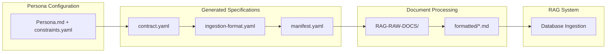

# Persona-Driven RAG Document Ingestion Pipeline

## Overview

This document describes the complete persona-driven document ingestion pipeline that transforms raw documents into a searchable RAG knowledge base. Each persona has its own customized processing rules, format specifications, and quality requirements.

## Pipeline Flow

The ingestion pipeline follows this sequential process:



### Pipeline Stages

1. **Persona Configuration** → **Contract Generation**
   - Input: `Persona.md` + `constraints.yaml`
   - Output: `contract.yaml`
   - Purpose: Define allowed document types, entities, and processing rules

2. **Contract** → **Ingestion Format Specification**
   - Input: `contract.yaml`
   - Output: `ingestion-format.yaml`
   - Purpose: Define required YAML frontmatter and content structure for each docType

3. **Ingestion Format** → **Document Manifest**
   - Input: `ingestion-format.yaml` + `RAG-RAW-DOCS/`
   - Output: `manifest.yaml`
   - Purpose: Scan raw documents, classify by docType, and create processing plan

4. **Manifest + Raw Documents** → **Formatted Markdown**
   - Input: `manifest.yaml` + raw documents
   - Output: `formatted/*.md` files
   - Purpose: Extract content using appropriate processors and format according to ingestion specifications

5. **Formatted Markdown** → **Database Ingestion**
   - Input: `formatted/*.md` files
   - Output: Vector embeddings + SQL metadata in database
   - Purpose: Make documents searchable in RAG system

## File Structure

For each persona, the pipeline creates this structure:

```
personas/{persona_name}/
├── Persona.md                 # 📝 Persona definition (user-provided)
├── constraints.yaml           # ⚙️  Processing constraints (user-provided)
├── contract.yaml              # 📋 Generated processing contract
├── ingestion-format.yaml      # 📄 Generated format specification
├── RAG-RAW-DOCS/             # 📁 Raw documents to process
│   ├── Papers/               # Academic papers (PDFs)
│   ├── Patents/              # Patent documents (PDFs)
│   ├── Notes/                # Personal notes (Markdown)
│   └── blogs/                # Blog articles (Markdown)
├── manifests/
│   └── manifest.yaml         # 📊 Document processing manifest
├── formatted/                # 📤 Processed documents ready for ingestion
│   ├── papers/
│   ├── patents/
│   ├── press-articles/
│   └── notes/
└── logs/                     # 📋 Processing logs
```

## Scripts and Commands

### Core Scripts

| Script | Purpose | Location |
|--------|---------|----------|
| `generate-contract.js` | Generate persona contract from Persona.md + constraints.yaml | `bin/generate-contract.js` |
| `generate-ingestion-format.js` | Generate format specification from contract | `bin/generate-ingestion-format.js` |
| `generate-manifest.js` | Generate document processing manifest | `bin/generate-manifest.js` |
| `process-manifest.js` | Process documents according to manifest *(pending)* | `bin/process-manifest.js` |

### Makefile Commands

#### Individual Pipeline Steps

```bash
# 1. Validate persona configuration
make validate-persona-{PERSONA}

# 2. Generate contract from persona + constraints
make generate-contract-{PERSONA}
make generate-contract-fuzzy-{PERSONA}  # With Gemini augmentation

# 3. Validate contract
make validate-contract-{PERSONA}

# 4. Generate ingestion format from contract
make generate-ingestion-format-{PERSONA}
make generate-ingestion-format-force-{PERSONA}  # Force regeneration

# 5. Validate ingestion format
make validate-ingestion-format-{PERSONA}

# 6. Generate processing manifest
make generate-manifest-{PERSONA}
make generate-manifest-review-{PERSONA}  # With Gemini review

# 7. Validate manifest
make validate-manifest-{PERSONA}

# 8. Process documents (convert to formatted markdown)
make process-manifest-{PERSONA}

# 9. Validate formatted documents
make validate-formatted-{PERSONA}

# 10. Ingest to database
make ingest-{PERSONA}

# Health check and diagnostics
make health-{PERSONA}
```

#### Full Pipeline Automation

```bash
# Run complete pipeline for a persona
make all-{PERSONA}

# Examples
make all-david                 # Process david persona end-to-end
make all-legal                 # Process legal persona end-to-end
make all-medical               # Process medical persona end-to-end
```

#### Utility Commands

```bash
# Project setup
make setup                     # Initialize directory structure

# Status and monitoring
make status                    # Check all personas status
make list-personas            # List available personas
make health-{PERSONA}         # Detailed health report for persona

# Cleanup
make clean-{PERSONA}          # Clean processed files for persona
make clean-all                # Clean all generated files
```

## Manual Execution Examples

### Example 1: Process David Persona from Scratch

```bash
# Step 1: Ensure persona files exist
ls personas/david/Persona.md
ls personas/david/constraints.yaml
ls personas/david/RAG-RAW-DOCS/

# Step 2: Run full pipeline
make all-david

# Step 3: Check results
make health-david
ls personas/david/formatted/
```

### Example 2: Add New Documents to Existing Persona

```bash
# Step 1: Add new documents to RAG-RAW-DOCS
cp new-paper.pdf personas/david/RAG-RAW-DOCS/Papers/
cp new-article.md personas/david/RAG-RAW-DOCS/Notes/

# Step 2: Regenerate manifest and process
make generate-manifest-review-david
make process-manifest-david
make ingest-david

# Step 3: Verify ingestion
make health-david
```

### Example 3: Create New Persona

```bash
# Step 1: Create persona directory and files
mkdir -p personas/legal
cp templates/Persona.template.md personas/legal/Persona.md
cp templates/constraints.template.yaml personas/legal/constraints.yaml

# Step 2: Edit persona files for legal domain
vim personas/legal/Persona.md
vim personas/legal/constraints.yaml

# Step 3: Add raw documents
mkdir -p personas/legal/RAG-RAW-DOCS/{Cases,Statutes,Briefs}

# Step 4: Run full pipeline
make all-legal
```

## Document Processing Details

### Supported Document Types

The pipeline supports these document types with specialized processing:

| DocType | Raw Format | Processor | Output Location | Special Requirements |
|---------|------------|-----------|-----------------|---------------------|
| `papers` | PDF | `gemini`, `exa` | `formatted/papers/` | Abstract, methods, results sections required |
| `patents` | PDF | `gemini`, `exa` | `formatted/patents/` | **Claims must be verbatim** |
| `press-articles` | URL, Markdown | `exa`, `gemini` | `formatted/press-articles/` | OEM, model extraction |
| `notes` | Markdown | `passthrough` | `formatted/notes/` | Direct processing |
| `books` | PDF | `gemini` | `formatted/books/` | Chapter/page range support |

### Extraction Methods

1. **Passthrough**: Direct markdown processing for local files
2. **PDF**: Gemini CLI for comprehensive extraction
3. **EXA**: Web content extraction with metadata enhancement
4. **Gemini**: Universal fallback with advanced prompting

### Processing Priority

For each document, processors are attempted in this order:
1. **Passthrough** (local markdown files)
2. **Gemini CLI** (PDFs and complex documents)
3. **EXA API** (web URLs and online content)
4. **WebFetch** (fallback for web content)

## Quality Assurance

### Validation Checkpoints

1. **Contract Validation**: Ensures persona configuration is complete
2. **Format Validation**: Verifies ingestion format specifications
3. **Manifest Validation**: Confirms document classification accuracy
4. **Content Validation**: Validates YAML frontmatter and markdown structure
5. **Ingestion Validation**: Confirms successful database insertion

### Error Handling

- **Graceful Fallback**: Multiple extraction methods per document
- **Retry Logic**: Automatic retry with exponential backoff
- **Skip Existing**: Avoid reprocessing already-ingested documents
- **Detailed Logging**: Comprehensive error reporting in `logs/`

## Monitoring and Diagnostics

### Health Report Contents

```bash
make health-david
```

Output includes:
- ✅/❌ Contract Status
- ✅/❌ Ingestion Format Status
- ✅/❌ Manifest Status
- 📊 Document counts by type and status
- 📁 Raw documents count
- 📝 Formatted documents count
- 🎯 Suggested next steps

### Common Issues and Solutions

| Issue | Symptom | Solution |
|-------|---------|----------|
| Missing contract | ❌ Contract Status: Missing | `make generate-contract-{PERSONA}` |
| Outdated format | Old ingestion format | `make generate-ingestion-format-force-{PERSONA}` |
| Classification errors | Wrong docTypes in manifest | `make generate-manifest-review-{PERSONA}` |
| Extraction failures | Processing errors in logs | Check raw document formats, retry with different processor |
| Validation failures | YAML frontmatter errors | Review ingestion format requirements |

## Canonical Entity and Alias Management

### Overview

The persona ingestion pipeline now includes a comprehensive canonical entity and alias management system that ensures consistent terminology across the knowledge base. This system allows personas to define canonical entities with their aliases, enabling automatic consolidation of variant terms during document processing.

### Key Features

1. **Canonical Entity Definitions**: Define authoritative entity names with their aliases
2. **Automatic Alias Resolution**: Map variant terms to canonical forms during ingestion
3. **Admin Interface**: Visual management of canonical entities and relationships
4. **Entity Merge Enhancement**: Promote frequently-used entities to canonical status
5. **Relationship Modeling**: Define semantic relationships between canonical entities

### Configuration in constraints.yaml

Canonical entities are defined in the persona's `constraints.yaml` file:

```yaml
# Canonical Entity Definitions with Aliases
canonical_entities:
  technology:
    "Pixel Mapping Algorithm":
      description: "Algorithm that assigns stereo pixel values to display given head position, 3D image and calibration data"
      aliases: ["pixel mapping", "subpixel mapping", "stereo view mapping", "view mapping", "weaving", "interlacing"]
      priority: 10
      domain: "spatial_computing"
    "Switchable LC Optical Layer":
      description: "Switchable liquid crystal optical layer add-on that makes a display switch from 2D to 3D"
      aliases: ["3D Cell", "2D3D switchable Cell", "2D3D switchable layer"]
      priority: 9
      domain: "spatial_computing"

  component:
    "Eye Tracking Sensor Array":
      description: "Multi-camera sensor system for precise gaze tracking"
      aliases: ["eye tracker array", "gaze sensor array", "multi-point eye tracking"]
      priority: 8
      domain: "spatial_computing"

# Entity Relationship Templates
canonical_relationships:
  - from: "Pixel Mapping Algorithm"
    relation: "enables"
    to: "Lightfield Display Technology"
    confidence: 0.95
    context: "Core algorithm for view synthesis"
  - from: "Eye Tracking Sensor Array"
    relation: "enhances"
    to: "Pixel Mapping Algorithm"
    confidence: 0.9
    context: "Provides precise head position data"
```

### Schema Structure

#### CanonicalEntityDefinition
- **description**: Detailed description of the canonical entity
- **aliases**: Array of alternative terms that map to this canonical entity
- **priority**: Integer 1-10 indicating consolidation priority (higher = preferred)
- **domain**: Optional domain classification (e.g., "spatial_computing")

#### CanonicalRelationshipDefinition
- **from**: Source canonical entity name
- **relation**: Relationship type (enables, enhances, implements, etc.)
- **to**: Target canonical entity name
- **confidence**: Confidence score 0-1 for the relationship
- **context**: Optional contextual description

### Admin Interface

#### Canonical Entity Management (`/admin/canonical-entities`)

The admin interface provides comprehensive management capabilities:

**Entity Management Tab:**
- View and search canonical entities by type (technology, component, person, organization, product)
- Add, edit, and delete canonical entities
- Manage aliases for each entity
- Set priority and domain classifications
- Visual similarity detection for duplicate prevention

**Relationships Tab:**
- Define semantic relationships between canonical entities
- Set confidence scores and contextual descriptions
- Visual relationship mapping
- Relationship validation and conflict detection

**Import/Export Tab:**
- Bulk import canonical entities from JSON/CSV
- Export configurations for backup or migration
- Validation and preview before import

#### Enhanced Entity Merge Dialog

The existing entity merge dialog now includes canonicalization options:

**Promotion to Canonical:**
- Checkbox to promote merged entity to canonical status
- Shows existing canonical entities for context
- Configure canonical description, priority, and domain
- Automatic alias generation from source entity names

**Smart Suggestions:**
- Displays similar existing canonical entities
- Prevents duplicate canonical definitions
- Suggests appropriate priority levels based on entity usage

### Processing Pipeline Integration

#### During Document Ingestion

1. **Entity Extraction**: Standard entity extraction from document content
2. **Canonical Matching**: Compare extracted entities against canonical definitions
3. **Alias Resolution**: Map aliases to their canonical forms
4. **Consolidation**: Store entities using canonical names
5. **Relationship Enhancement**: Apply canonical relationships to improve knowledge graph

#### Entity Consolidation Process

```typescript
// Example: During entity processing
const extractedEntity = "pixel mapping";
const canonicalMatch = findCanonicalEntity(extractedEntity, "technology");
if (canonicalMatch) {
  // Use canonical name: "Pixel Mapping Algorithm"
  entityName = canonicalMatch.canonicalName;
  aliases = [...canonicalMatch.aliases];
}
```

### API Endpoints

#### Canonical Entity Management
- `GET /api/admin/personas/{persona}/canonical-entities`: Retrieve canonical entities
- `PUT /api/admin/personas/{persona}/canonical-entities`: Update canonical entities
- `POST /api/admin/personas/{persona}/canonical-entities`: Validate or export data

#### Entity Operations
- `POST /api/admin/entities/merge`: Enhanced merge with canonicalization options
- `GET /api/admin/entities/canonical-suggestions`: Get canonical suggestions for entity

### Benefits

#### For Domain Experts
- **Terminology Consistency**: Ensure same concepts use consistent names
- **Knowledge Capture**: Encode domain expertise in structured format
- **Alias Management**: Handle multiple ways of referring to same concept

#### For Search and Retrieval
- **Query Expansion**: Search "weaving" finds "Pixel Mapping Algorithm"
- **Improved Precision**: Reduce semantic fragmentation
- **Better Ranking**: Boost results with canonical entities

#### For Knowledge Graph
- **Entity Consolidation**: Fewer duplicate entities
- **Relationship Quality**: More accurate entity relationships
- **Cross-Document Linking**: Better connections between documents

### Example Use Cases

#### David Persona (3D Display Technology)
- **Technical Terms**: "lightfield", "light field", "light-field" → "Lightfield Display Technology"
- **Process Names**: "pixel mapping", "view mapping", "weaving" → "Pixel Mapping Algorithm"
- **Components**: "3D Cell", "switchable cell" → "Switchable LC Optical Layer"

#### Legal Persona (Hypothetical)
- **Case Types**: "personal injury", "PI case", "tort claim" → "Personal Injury Case"
- **Legal Concepts**: "due process", "procedural due process" → "Due Process Rights"
- **Court Levels**: "SCOTUS", "Supreme Court", "US Supreme Court" → "Supreme Court of the United States"

### Validation and Quality Control

#### Automated Validation
- Schema validation for canonical entity structure
- Duplicate detection across aliases
- Relationship consistency checking
- Priority and confidence range validation

#### Manual Review
- Admin interface for reviewing suggested canonicals
- Bulk operations with preview and approval
- Conflict resolution workflows
- Quality metrics and reporting

### Performance Considerations

#### Memory Efficiency
- In-memory alias maps for fast lookups
- Lazy loading of canonical definitions
- Efficient string matching algorithms

#### Processing Overhead
- Minimal impact on document ingestion (< 5% overhead)
- Batch processing for alias resolution
- Caching of frequently-used canonical mappings

### Migration and Maintenance

#### Updating Existing Data
- Gradual migration of existing entities to canonical forms
- Backward compatibility with non-canonical entities
- Bulk update tools for large-scale changes

#### Version Control
- Track changes to canonical definitions
- Rollback capabilities for incorrect updates
- Change impact analysis tools

This canonical entity system transforms the RAG knowledge base from a collection of documents with inconsistent terminology into a cohesive, semantically-structured knowledge graph where domain expertise is encoded and consistently applied.

## Integration Points

### Database Schema

Formatted documents are ingested into these tables:
- `documents`: Metadata and content
- `document_chunks`: Text chunks for vector search
- `document_entities`: Extracted entities and relationships
- `document_citations`: Citation relationships

### API Endpoints

- `POST /api/ingestion/personas/{persona}`: Trigger ingestion pipeline
- `GET /api/ingestion/personas/{persona}/status`: Get pipeline status
- `GET /api/ingestion/personas/{persona}/health`: Get detailed health report

### Admin Interface Integration

The pipeline is designed for future web-based administration:
- **Pipeline Status Dashboard**: Real-time progress monitoring
- **Document Upload Interface**: Drag-and-drop for RAG-RAW-DOCS
- **Pipeline Configuration**: Edit persona constraints through UI
- **Processing Queue**: Monitor and manage document processing jobs
- **Quality Review**: Manual review of extracted documents before ingestion

## Performance Considerations

### Rate Limiting

- **EXA API**: 3-second delay between requests
- **Gemini CLI**: 2-second delay between requests
- **Concurrent Processing**: Maximum 4 parallel documents

### Optimization Tips

1. **Batch Processing**: Group documents by type for efficiency
2. **Incremental Updates**: Only process new/changed documents
3. **Quality Thresholds**: Set extraction quality requirements per persona
4. **Resource Management**: Monitor disk space in `formatted/` directories

## Future Enhancements

### Planned Features

1. **Web-based Pipeline Management**: Full admin interface for pipeline control
2. **Real-time Processing**: WebSocket-based progress updates
3. **Advanced Quality Scoring**: ML-based quality assessment
4. **Multi-language Support**: Document processing in multiple languages
5. **Custom Processors**: Plugin architecture for specialized document types

### Extensibility

The pipeline is designed for easy extension:
- **New Document Types**: Add to contract and ingestion format
- **Custom Processors**: Implement new extraction methods
- **Persona Templates**: Reusable persona configurations
- **Quality Metrics**: Custom validation rules per domain

## Getting Started

### Quick Start for New Persona

1. **Create persona directory**:
   ```bash
   mkdir -p personas/my-persona/RAG-RAW-DOCS
   ```

2. **Create configuration files**:
   ```bash
   cp templates/Persona.template.md personas/my-persona/Persona.md
   cp templates/constraints.template.yaml personas/my-persona/constraints.yaml
   ```

3. **Add documents**:
   ```bash
   cp *.pdf personas/my-persona/RAG-RAW-DOCS/
   ```

4. **Run pipeline**:
   ```bash
   make all-my-persona
```

5. **Verify results**:
   ```bash
   make health-my-persona
   ```

### Development Workflow

1. **Modify persona configuration**
2. **Regenerate contract and format**: `make generate-contract-{PERSONA} generate-ingestion-format-force-{PERSONA}`
3. **Update manifest**: `make generate-manifest-review-{PERSONA}`
4. **Process documents**: `make process-manifest-{PERSONA}`
5. **Test ingestion**: `make ingest-{PERSONA}`

This pipeline ensures consistent, high-quality document processing tailored to each persona's domain expertise and requirements.